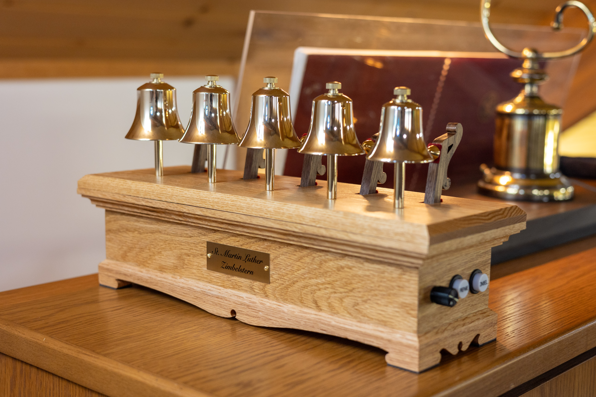
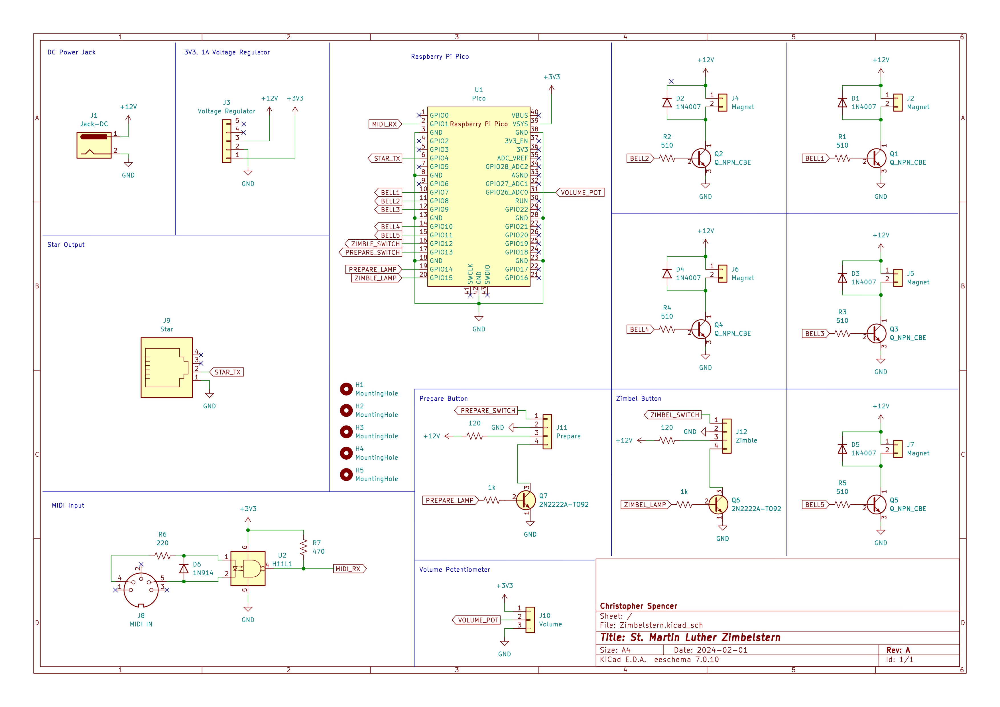

# The St. Martin Luther Zimbelstern

A MIDI-enabled zimbelstern for organs without one.

  
   

 
This repo contains the code, schematics, and cad design files for the St. Martin Luther Zimbelstern.

## Design Overview

The St. Martin Luther Zimbelstern is an instrument designed for organs without a zimbelstern built into them. It features a solid oak case which fits comfortably on top of the organ console, allowing the controls to be in easy reach of the organist. In addition to a traditional Zimbel button for starting and stopping the zimbelstern, the St. Martin Luther Zimbelstern features a Prepare button which, when connected to a supported organ via MIDI, can identify when an organist begins playing the keyboards and automatically starts the zimbelstern.

Unlike more traditional designs which employ a rotating mechanism to strike a series of bells, this design allows for each bell to be played individually. Each bell is struck with a hammer which is actuated with an electromagnet. This allows the bells to be played at random, rather than in a predefined repeating sequence, as well as allowing adjustment over the speed and volume of the ringing. The electromagnets are controlled by a Raspberry Pi Pico microcontroller which lies at the heart of the zimbelstern, and is responsible for the entire operation of the zimbelstern.

The instrument uses 5 tuned Malmark handbells which form the D minor pentatonic scale. The pitches are D7, F7, G7, A7, and C8.

### MIDI Integration

The St. Martin Luther Zimbelstern has a MIDI IN port which can be connected to the MIDI OUT on a supported organ. The MIDI connection is only one-way, which means the zimbelstern only listens to the organ and does not talk back.

The MIDI connection is used for the Prepare button, which, when engaged will listen for "Note On" MIDI messages from the organ. When one of these messages is received, the microcontroller knows the organist has begun playing and will automatically start the zimbelstern.

Additionally, the MIDI connection is used to determine if any stops are engaged on the organ. This way, if the organist has pressed the Prepare button on the zimbelstern, but not yet engaged a registration on the organ, the zimbelstern will not start from an accidental silent key press. This functionality reads System Exclusive MIDI messages to identify if any stops are activated*, however, these are unique per organ manufacturer. As a result, the Prepare button will only work on Rodgers organs or any organ that uses the Rodgers/Roland SysEx message format. Support for other organs can be added by adding logic to read their SysEx message format.

*If the zimbelstern is plugged in after the organ is turned on, a stop change needs to be made on the organ to trigger a SysEx message so the zimbelstern can know the current state of the organ.

## Electronics

### Circuit Board

* [JLCPCB](https://jlcpcb.com/) was used to order the PCB. The folder `Zimbel-2024-03-03` contains a KiCad export of all the files needed to order a new board from a PCB fabricator.

## Known Design Flaws

This zimbelstern was developed rapidly over 6 months and has some flaws. Below is a list of things that should be improved in future versions:

* Hammers produce an undesirable clacking sound when striking the bell
  * This is caused by a number of reasons, and may not be fixable without changing the hammer mechanism entirely.
  * The clearest bell rings occur when the striking object makes contact for the shortest amount of time possible. The longer the striking object remains on the bell, the more muted the tone will become until it doesn't ring at all. This is the first issue. The electromagnets cannot move the hammers fast enough. One solution is to reduce the weight of the hammers so they can swing faster. A better solution would be to use a mechanism similar to a grandfather clock, where the hammer is pulled back and springs forward to strike the bell.
  * The second issue is that the wooden hammer is absorbing some of the vibrations when striking and the wood is producing a dull echoing sound. Loosening the brass hammer head and adding a felt pad between the wooden hammer has helped to reduce this, but does not solve it entirely. One solution is to build the hammers out of a different material, such as all brass.
* ZIMBEL piston lamp voltage not properly regulated
  * The piston lamps operate at 5v, and are said to be used with a series resistor in Rodgers organs. This same type of series resistor configuration was used in the zimbelstern circuit to reduce the main 12v source to 5v. However, since the electromagnets also draw from the main 12v source a flickering in the piston lamp is produced when the zimbelstern is ringing.
  * One solution is to properly regulate the 12v to 5v using a buck converter. In the production model, the series resistor was removed and an extra buck converter wired in place. A proper fix would build this into the PCB.
