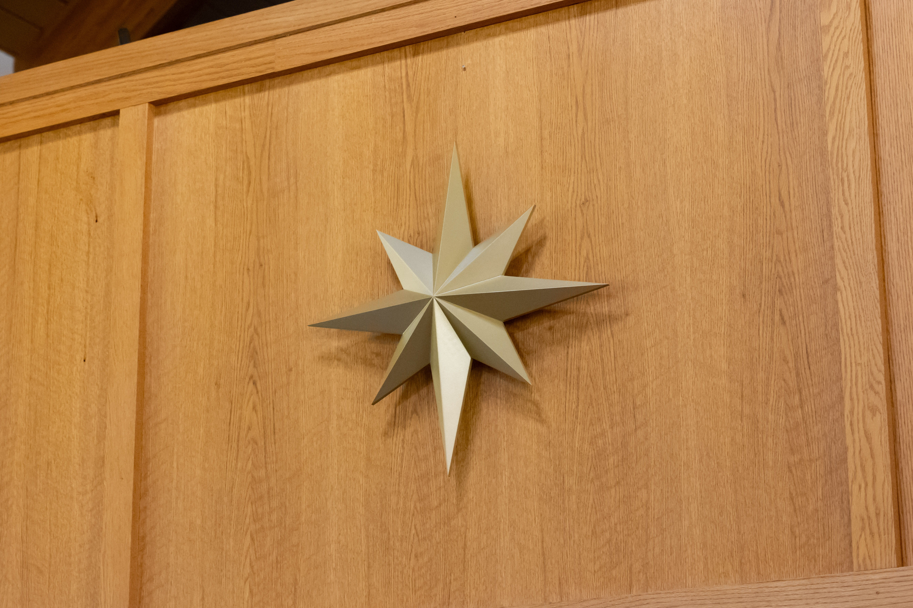
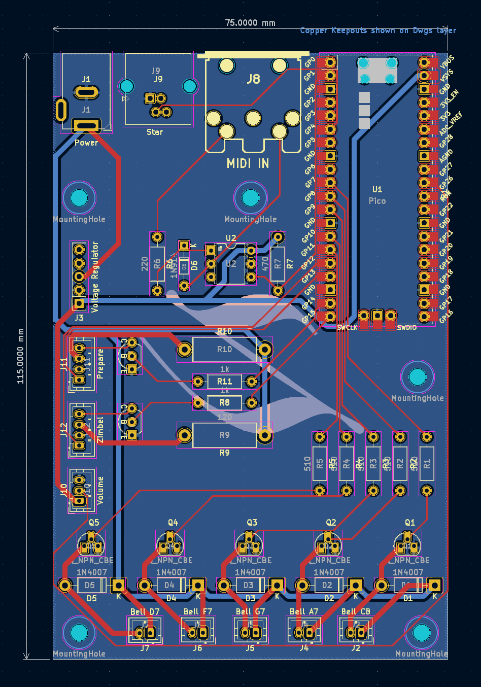

# The St. Martin Luther Zimbelstern

Code, documentation, and design files for the St. Martin Luther Zimbelstern.

<!-- 

  
   

 -->

## Design Overview

The St. Martin Luther Zimbelstern is an instrument designed for organs without a zimbelstern built into them. It features a solid oak case which fits comfortably on top of the organ console, allowing the controls to be in easy reach of the organist. The zimbelstern is equipped with MIDI and can be connected to a supported organ to make full use of its features. The Prepare feature uses MIDI to identify when the organist begins playing the keyboards and automatically starts the zimbelstern. 

Unlike more traditional designs which employ a rotating mechanism to strike a series of bells, this design allows for each bell to be played individually. Each bell is struck with a hammer which is actuated with an electromagnet. This allows the bells to be played at random, rather than in a predefined repeating sequence, as well as allowing adjustment over the speed and volume of the ringing. The electromagnets are controlled by a Raspberry Pi Pico microcontroller which lies at the heart of the zimbelstern, and is responsible for the entire operation of the zimbelstern.

The instrument uses 5 tuned Malmark Handbells which form the D Minor Pentatonic scale. The pitches are D7, F7, G7, A7, and C8. The use of a pentatonic scale removes the possibility of dissonant tones while the zimbelstern is playing.

## Electronics

## Design Flaws

This zimbelstern was developed rapidly over 6 months and is not without some flaws. Below is a list of things that should be improved in future iterations:

* Hammers produce an undesirable clacking sound when striking the bell
  * This is caused by a number of reasons, and may not be fixable without changing the hammer design entirely.
  * The clearest bell rings occur when the striking object makes contact for the shortest amount of time possible. The longer the striking object remains on the bell, the more muted the tone will become until it doesn't ring at all. This is the first issue. The electromagnets cannot move the hammers fast enough. One solution is to reduce the weight of the hammers so they can swing faster. A better solution would be to use a mechanism similar to a grandfather clock, where the hammer is pulled back and springs forward to strike the bell.
  * The second issue is that the wooden hammer is absorbing some of the vibrations when striking and the wood is producing a dull echoing sound. Loosening the brass hammer head and adding a felt pad between the wooden hammer has helped to reduce this, but does not solve it entirely. One solution is to build the hammers out of a different material, such as all brass.
* Zimbel piston lamp voltage not properly regulated
  * The piston lamps operate at 5v, and are said to be used with a series resistor in Rodgers organs. This same type of series resistor configuration was used in the zimbelstern circuit to reduce the main 12v source to 5v. However, since the electromagnets also draw from the main 12v source a flickering in the piston lamp is produced when the zimbelstern is ringing.
  * One solution is to properly regulate the 12v to 5v using a buck converter. In the production model, the series resistor was removed and an extra buck converter wired in place. A proper fix would include this in the PCB.
